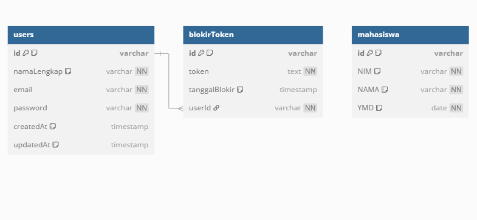

## ERD


## Entities

- User
- Mahasiswa

## Dokumentasi api 

https://documenter.getpostman.com/view/40800436/2sB2cd4xf1

##  Cara Menjalankan Proyek

### 1. Clone Repository
```sh
git clone https://github.com/MujahidRamdhani/be-auth-crud-mahasiswa-express.git
cd be-auth-crud-mahasiswa-express
```

### 2. Install Dependencies
```sh
npm install
```

### 3. Push Struktur Database ke Prisma
```sh
npx prisma db push
```

### 4. Menjalankan Server
```sh
npm run dev -- --service=rest
```
